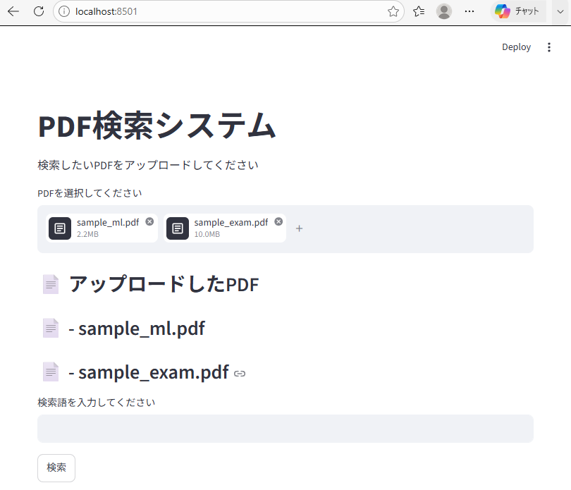
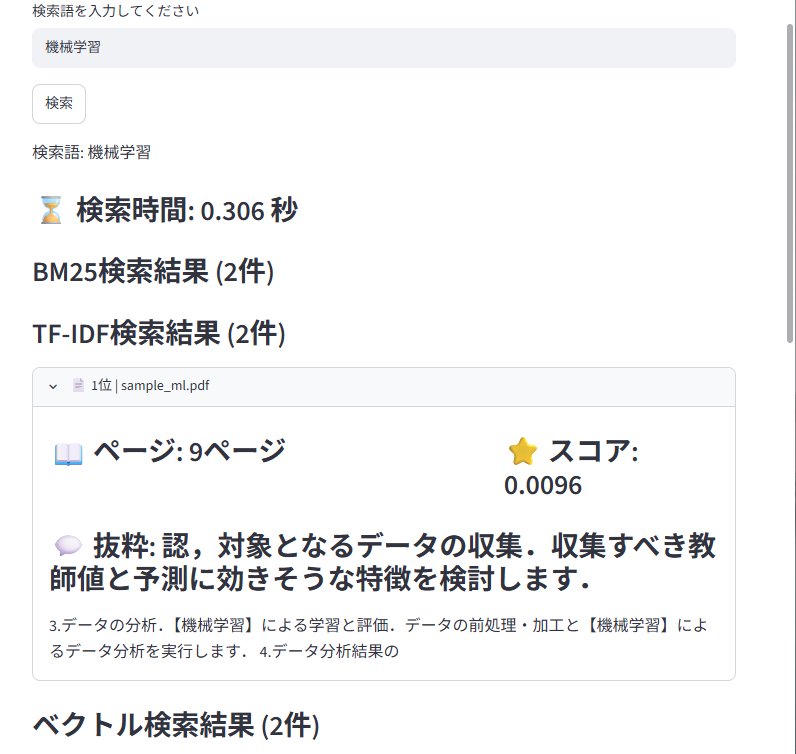
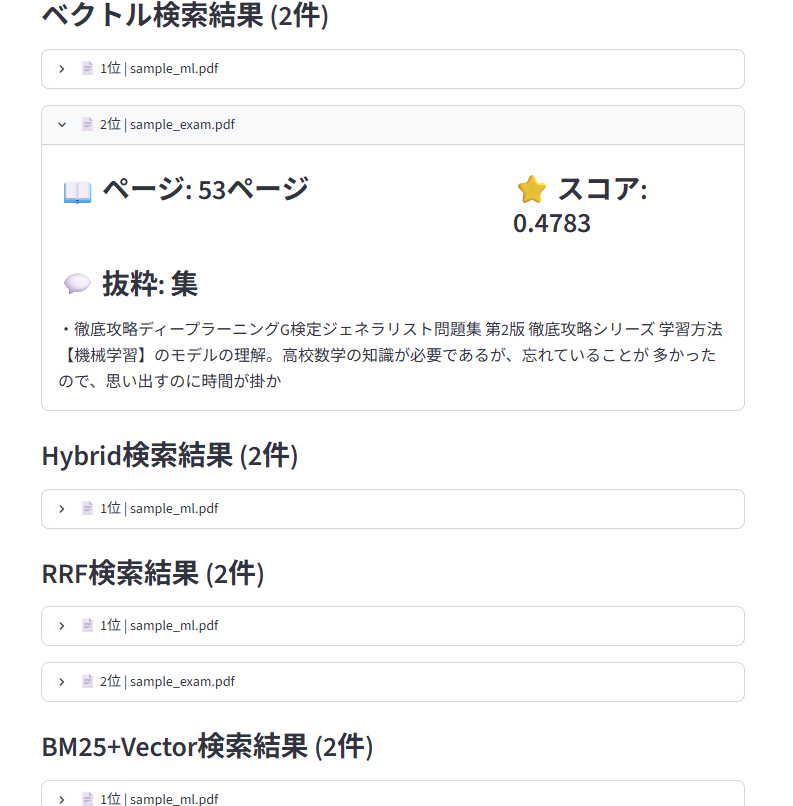

# PDF Learning Support System

## 概要
機械学習・情報検索・自然言語処理を用いたシステム構築を実践的に学ぶことを目的として開発した、日本語PDF検索・学習支援システムです。

BM25、TF-IDF、Vector Search、Reciprocal Rank Fusion（RRF）、Learning to Rank（LTR）を段階的に実装し、検索精度の比較・評価・改善を行いました。

本プロジェクトでは、検索アルゴリズムの実装だけでなく、Recall・Precision・MRR・NDCG などの評価指標を用いた性能評価や、StandardScaler による特徴量正規化を導入し、ランキング性能の向上まで含めて設計・実装しました。

就職活動用のポートフォリオとして、情報検索システムの設計・実装・評価・改善の一連のプロセスを経験することを目的としています。

## スクリーンショット

### 検索画面



### 検索結果画面



### 検索手法比較画面



BM25、 TF-IDF、 vector Search、 Hybrid Search、 RRF、 BM25+Vector、 Learning to Rank
の検索結果を比較し、ランキング性能の改善を検証できる構成とした。

就職活動におけるPDF資料の情報収集を効率化することを目的として開発した、日本語PDF検索・学習支援システムです。

BM25、TF-IDF、Vector Search、Reciprocal Rank Fusion（RRF）、Learning to Rank（LTR）を組み合わせ、検索精度の向上を目指しました。

本プロジェクトは、情報検索・自然言語処理・機械学習の学習およびポートフォリオ作成を目的として開発しています。

## 主な機能
- PDFテキスト抽出
- 日本語テキスト前処理（正規化・ストップワード除去）
- BM25検索
- TF-IDF検索
- Vector Search
- Hybrid Search
- Reciprocal Rank Fusion（RRF）
- Learning to Rank（LTR）による検索順位最適化
- 検索結果ハイライト表示
- PDF要約機能
- 検索性能評価（Recall, Precision, F1, MRR, AP, NDCG）


## システム構成

'''text
PDF
 ↓
テキスト抽出
 ↓
日本語前処理
 ↓
 ┌─────────────┐
 │ BM25        │
 │ TF-IDF      │
 │ Vector      │
 └─────────────┘
      ↓
  Hybrid / RRF
      ↓
Learning to Rank
      ↓
検索結果表示（Streamlit）
```


技術スタック

言語

- Python

ライブラリ

- Streamlit
- scikit-learn
- PyTorch
- Janome
- PyMuPDF
- NumPy
- pandas


## 実行方法

### 必要ライブラリのインストール

```bash
pip install -r requirements.txt
```

### アプリ起動

```bash
streamlit run app.py
```

## 評価結果

検索システムの性能を比較するため、複数のランキング評価指標を実装しました。

使用した評価指標

- Recall@K
- Precision@K
- F1 Score
- Mean Reciprocal Rank (MRR)
- Average Precision (AP)
- Normalized Discounted Cumulative Gain (NDCG)

Learning to Rank の性能

StandardScaler による特徴量正規化を導入した結果、LTR モデルは以下の性能を達成しました。

| Method | MRR | NDCG |
|-------|------:|------:|
|Learning to Rank | **0.898** | **0.925** |

LTR は BM25・TF-IDF・Vector Search のスコアを特徴量として利用し、検索順位を学習によって最適化しています。

工夫した点
- BM25、TF-IDF、Vector Search を独立したモジュールとして実装
- RRF による複数ランキングの統合
- Learning to Rank によるランキング最適化
- StandardScaler による特徴量スケーリング
- 検索アルゴリズムごとの性能比較基盤を構築
- モジュール分割により保守性・拡張性を向上


今後の改善

- SentenceTransformer を用いた高性能ベクトル検索
- LightGBM Ranker によるランキング学習
- Docker 対応
- UI の改善
- より大規模な PDF データセットでの評価